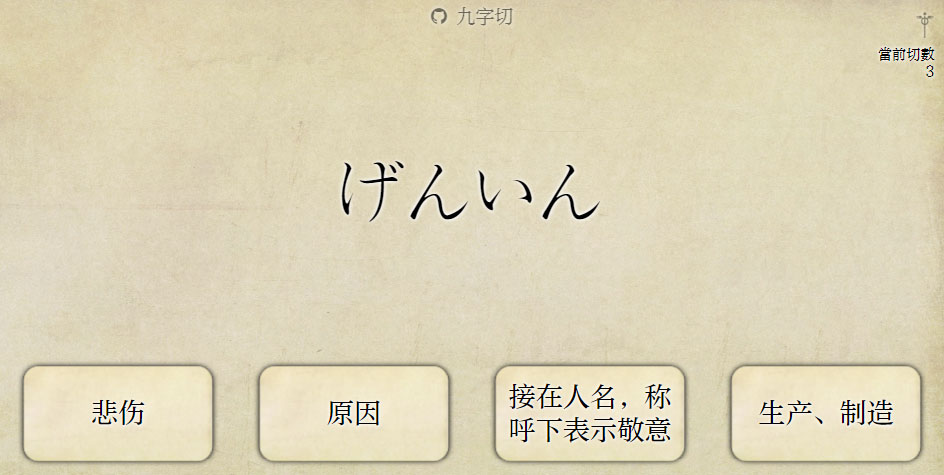

# 九字切！

就像是日文的「百詞斬」那樣的東西吧。

[在線使用](https://rimochan.github.io/jiu_zi_qie/index.html)

## 簡介

幫助(?)你背日文單詞的網站。

用起來長這樣:

### 關於命名
起名叫九字切的話，大概是因爲有一個差不多的「百詞斬」的緣故吧。

比起「百」，表示多數的「九」會不會更有文化內涵些呢(笑)？然後「斬」就是「切」嘛，讀起來也是一樣的(笑)。

## 算法

1. 使用固定的隨機種子打亂詞典

2. 將詞典頭部儘可能多的單詞裝進緩衝區

3. 從緩衝區加權隨機取出單詞作爲題目，初始單詞權重相同，取出一次後權重降低

4. 若單詞被「切」掉，將從緩衝區中刪除並且不會再出現

## 關於存檔

使用九字切不需要註冊帳號，你的數據是永遠存檔在cookie裏的(如果你不清理cookie的話)。

## 注意

+ 默認詞典的什麼n1n2全是我網上隨便找的，我也不知道是不是真的，說不定我被網友耍了呢……

+ 詞典的質量不高，有些缺少詞性什麼的就不要在意了。

+ 數據大約幾Ｍ，電信用戶訪問github page可能要加載一段時間。
